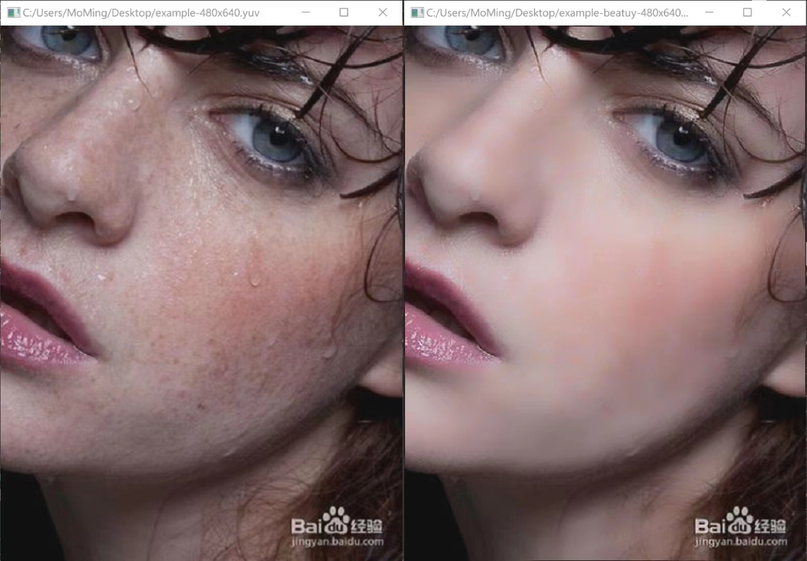
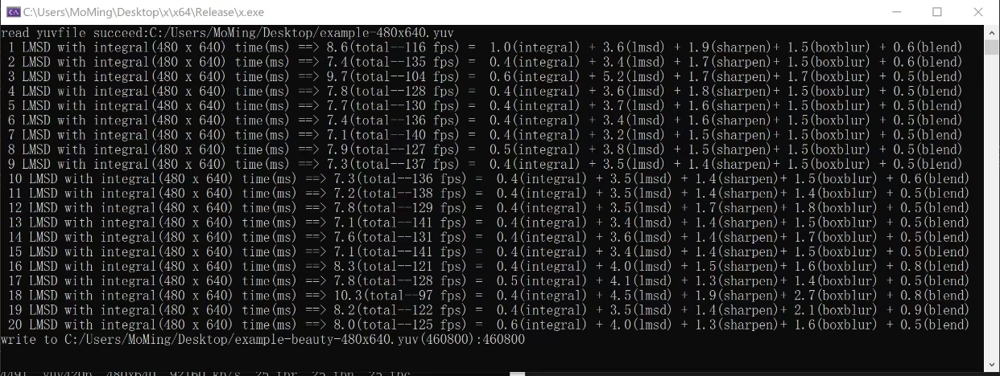
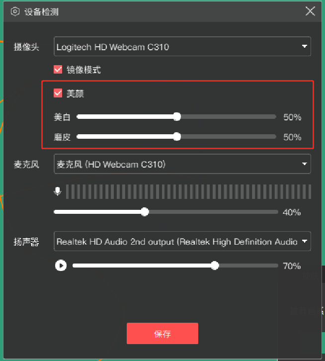

# face_beauty
基于传统方法(非深度学习)的美颜算法实现，效果一般

## 一. 说明
1. 用在实时直播项目中：yuv420输入和输出
2. 实现了纯cpu版本和neon版本，neon版本有bug，慎用
3. 支持三个参数： 美白，磨皮，简化模式
4. 提供C++、纯C、JNI接口
5. 特点：高性能，算法本身就是基于yuv的原地操作。没有与rgb的转换和内存的拷贝。

## 二. 算法流程
1. 计算和与平方和的积分图
2. 局部均方差滤波 + 美白 + 皮肤检测
3. 锐化均方差滤波结果
4. 皮肤mask的box滤波
5. 均方差滤波与原图融合

## 三. 效果

